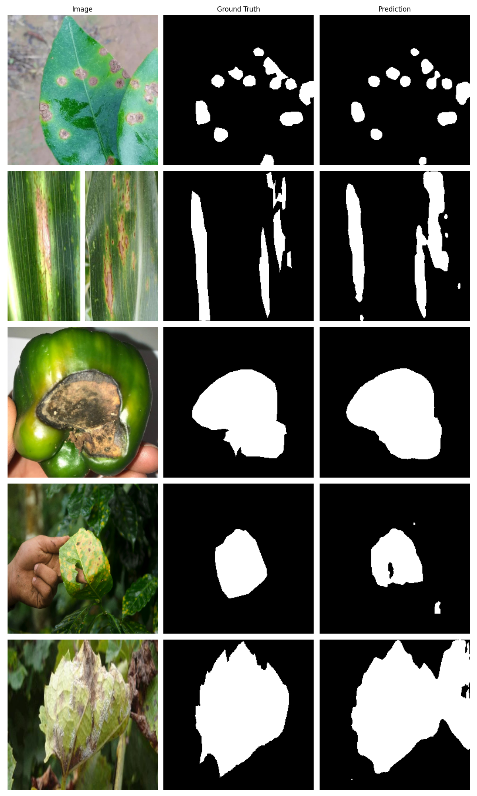

# Leaf Disease Segmentation

Binary segmentation of diseased regions on plant leaves using a UNet architecture with a pretrained MobileNetV2 encoder. Trained on the [PlantSegV2](https://www.kaggle.com/datasets/weitianqi/plantseg) dataset.

## Results




*Columns: Input Image | Ground Truth Mask | Predicted Mask*

The model segments diseased regions well on most samples. Some over-prediction occurs on complex backgrounds, likely due to similar texture/color between disease and background.

## Architecture

- **Model:** UNet + MobileNetV2 encoder (ImageNet pretrained)
- **Loss:** BCE + Dice (50/50)
- **Input size:** 256×256
- **Classes:** 1 (binary — disease vs background)

## Dataset

- **Source:** PlantSegV2 (Kaggle)
- **Size:** ~11k images

## Setup

```bash
pip install -r requirements.txt
```

## Train

```bash
python3 train.py                           # default config.yaml
python3 train.py --config my_config.yaml  # custom config
```

All hyperparameters are in config.yaml. 

## Evaluate
```bash
python3 eval.py --split test
python3 eval.py --split test --n 10 --save-dir ./eval_output
```

## Inference basic UI
```bash
python3 app.py
```

Launches a Gradio web interface. Upload a leaf image and get the overlay and the predicted mask. Must have a trained model under: ```./checkpoints/best.pth```
